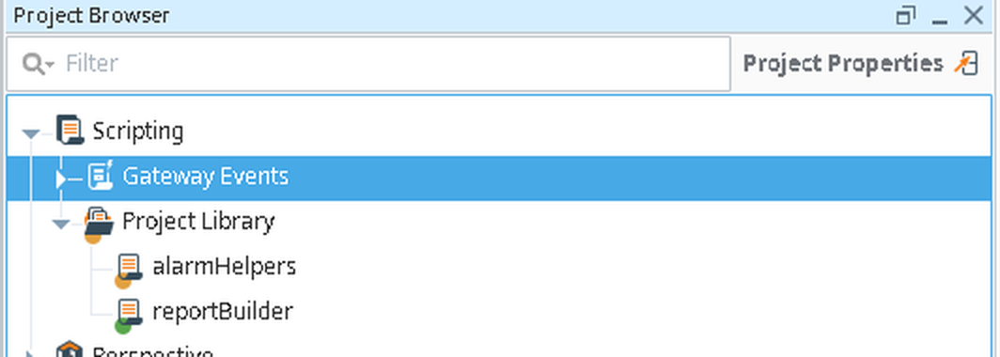
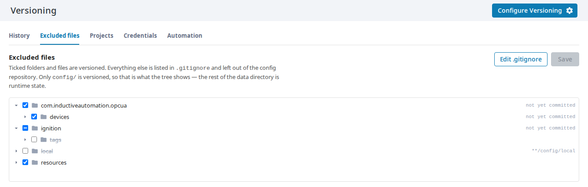
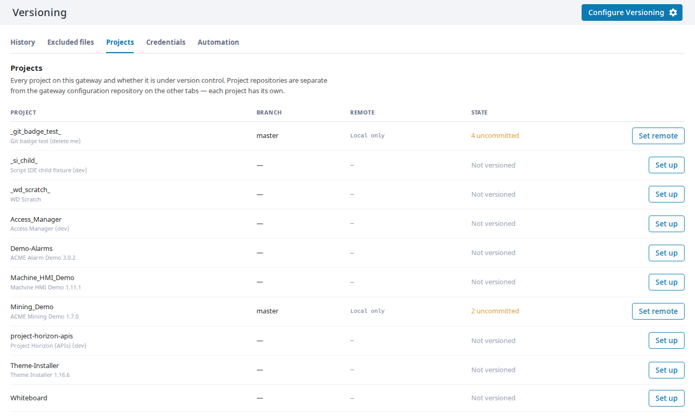
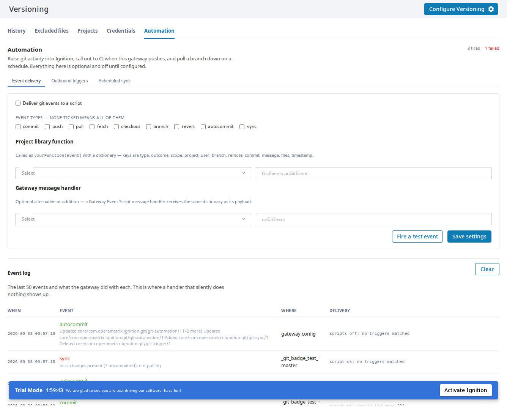

# Git Integration

Version control for Ignition 8.3 — project resources from the Designer, gateway
configuration from the gateway. A Gaskony build of
[OperaMetrix's Git module](https://github.com/operametrix/ignition-git-module),
under the Beerware licence.

## Why this exists

Two people editing the same gateway is two people overwriting each other, and a
gateway backup is a snapshot, not a history: it cannot tell you what changed
between Tuesday and Friday or who changed it. Ignition has no built-in answer,
so the answer is the one every other trade already uses — put it in git.

Upstream covers the Designer half well. This build adds what was missing in
practice: seeing at a glance which resources you have not committed, controlling
what the gateway-config repository actually versions, and answering from the
gateway itself which projects are in git at all. The second one was not cosmetic
— before it, a config repo on a working gateway grew to 827 MB of SQLite
databases and log files while showing an empty change list.

It also stops git being a thing you only do by hand. Commits, pushes and pulls
raise events an Ignition script can act on, a push can call GitHub Actions, and
a branch can come back down on a schedule — none of which needed a person in a
Designer.

## What it looks like

Uncommitted work is marked in the Project Browser, so you find it without
opening the Commit panel. Green is new, amber is changed, and a folder carries
the state of what is inside it — red if something under it was deleted, since a
deleted resource has no tree node of its own to mark.



The gateway's Versioning page decides what config-as-code covers. The tree is
rooted at `config/`, because that is the only thing the repository versions, and
a ticked row is a versioned one. Rows struck through are excluded, with the
`.gitignore` rule that excluded them shown on the right.



Which projects are under version control is answerable from the gateway, without
opening a Designer and without knowing where to look. Unversioned projects are
listed too — "not in git" and "not on this gateway" are otherwise
indistinguishable — and any of them can be initialised or given a remote here.



Git activity can drive Ignition. Every commit, push, pull and config auto-commit
raises an event, successes and failures alike, delivered to a project library
function or a Gateway Event message handler. The same events can call out to
GitHub Actions or any other endpoint. The event log below shows what the gateway
did with each one, which is where a handler that silently does nothing becomes
visible.



## What it does

**In the Designer** — clone or initialise a project repository, manage remotes
and credentials, commit from a dockable panel with per-resource selection, amend
the last commit, browse history and diffs, and push or pull. Uncommitted
resources are badged in the Project Browser.

**On the gateway** — versions `config/` as code, commits automatically when a
config resource changes, shows history and per-commit diffs, restores a previous
commit, and pushes to a remote. The Excluded files tree edits `.gitignore`
directly: ticking a tracked path also untracks it, and rules you wrote by hand
are never rewritten. Project repositories, the credentials they authenticate
with, and the automation below are all managed from the same page.

**Automation** — git activity raises an event carrying the type, outcome,
project, user, branch, commit, message and file list. Deliver it to a project
library function, a Gateway Event message handler, or both. A matching event can
also call a URL, with GitHub's `repository_dispatch` and `workflow_dispatch` as
presets and `${owner}`/`${repo}` derived from the repository's own remote, so one
rule serves every project. Inbound sync fetches on a timer and fast-forwards
when the tracked branch moves, then requests a project scan — polling rather
than a webhook, because GitHub cannot reach most gateways. A sync refuses when
the working tree is dirty rather than discarding someone's unsaved work.

Changes over upstream 2.1.0:

- Excluded-files tree on the Versioning page, and `.gitignore` editing.
- Change badges in the Designer's Project Browser.
- Projects and Credentials tabs: see and set up project repositories, and create
  the credentials they need, without opening a Designer first.
- Automation: git events into Jython, outbound triggers for CI, scheduled sync.
- Commits stage exactly what the change list shows. They previously staged the
  whole data directory.
- A nested repository is no longer reported as a change, which otherwise made
  the repo permanently dirty and produced an empty commit per config change.
- `initRepo` no longer races the tag value store — `*-wal`/`*-shm` are ignored.
  Without this, config versioning could not be initialised on a running gateway.
- An initialise that failed part-way no longer strands a project on an unborn
  branch, where every resource showed as a change and Pull asked the remote for
  a branch that had never existed.

## How to use it

Install the signed `.modl` from the latest release through the gateway's
**Config → Modules → Install or Upgrade Module**, then restart the gateway.

Project versioning: open a project, click **Configure** in the Designer's status
bar, and either clone a remote or initialise locally. Commit from the **Commit**
tab beside the Project Browser.

Gateway config versioning: **Platform → System → Versioning → Initialize
versioning**. Adjust what is covered under **Excluded files**.

Automation: **Platform → System → Versioning → Automation**. Tick *Deliver git
events to a script*, pick a project and a function path such as
`Git.Events.onGitEvent`, and press **Fire a test event** — the event log below
says whether it arrived. Outbound triggers and scheduled sync are on the same
tab.

To build from source you need `gradle.properties` with the signing block —
copy it from `gradle.template.properties` and fill in the keystore details:

```bash
./gradlew build      # -> build/GitIntegration.modl, signed
```

The module version lives in `version.properties` and nowhere else.

## Licence

Beerware (Revision 42) — see [LICENSE.md](LICENSE.md) and `license.html`. The
original notice is retained; this build is modified and distributed by Gaskony.
